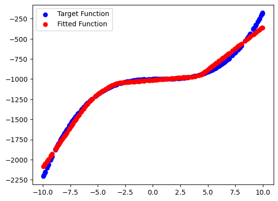
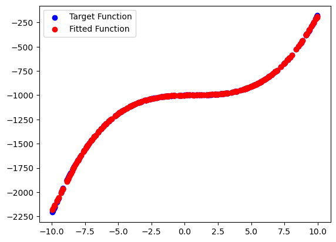

# 函数拟合实验报告

## 函数定义

本次实验拟合目标为该多项式方程。

```python
def target_function(x):
    return x**3-2*x**2+3*x-1000
```

## 数据采集

构造数据集：
1. 在-10到10之间随机采样2000个数，作为x
2. 利用已定义的target_function，构造y

```python
np.random.seed(42)
x = np.random.uniform(-10, 10, size=2000)
y = target_function(x)
x = torch.tensor(x, dtype=torch.float32).view(-1, 1)
y = torch.tensor(y, dtype=torch.float32).view(-1, 1)
```

3. 分割数据集，其中训练集占比0.7，验证集和测试集各占0.25

```python
train_size = int(0.7 * len(x))
val_size = int(0.15 * len(x))
test_size = len(x) - train_size - val_size
x_train, y_train = x[:train_size], y[:train_size]
x_val, y_val = x[train_size:train_size+val_size], y[train_size:train_size+val_size]
x_test, y_test = x[train_size+val_size:], y[train_size+val_size:]
```

## 模型描述

该模型使用pytorch框架搭建，包括两个全连接层，所用激活函数为relu。其中，隐藏层维度大小可自行定义。

```python
class SimpleNN(nn.Module):
    def __init__(self, hidden_dim):
        super(SimpleNN, self).__init__()
        self.fc1 = nn.Linear(1, hidden_dim)
        self.fc2 = nn.Linear(hidden_dim, 1)

    def forward(self, x):
        x = torch.relu(self.fc1(x))
        x = self.fc2(x)
        return x
```

## 训练过程

1. 共5000个epoch
2. 学习率为0.01
3. 使用MSELoss作为损失函数
4. 使用Adam优化器

```python
epochs = 5000
hidden_dim = 100

model = SimpleNN(hidden_dim)

criterion = nn.MSELoss()
optimizer = optim.Adam(model.parameters(), lr=0.01)

for epoch in range(epochs):
    y_pred = model(x_train)
    loss = criterion(y_pred, y_train)
    
    optimizer.zero_grad()
    loss.backward()
    optimizer.step()
    
    if (epoch+1) % 100 == 0:
        print(f'Epoch [{epoch+1}/{epochs}], Loss: {loss.item():.4f}')
```

训练过程中具体的Loss请参见relu.ipynb。

## 拟合效果

测试与验证：

```python
model.eval() 
with torch.no_grad():  
    y_test_pred = model(x_test).detach().numpy()

plt.scatter(x_test.numpy(), y_test, color='blue', label='Target Function')
plt.scatter(x_test.numpy(), y_test_pred,  color='red', label='Fitted Function')
plt.legend()
plt.show()
```

隐藏层维度为100时：



隐藏层维度为1000时：

