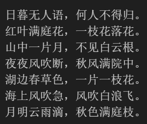
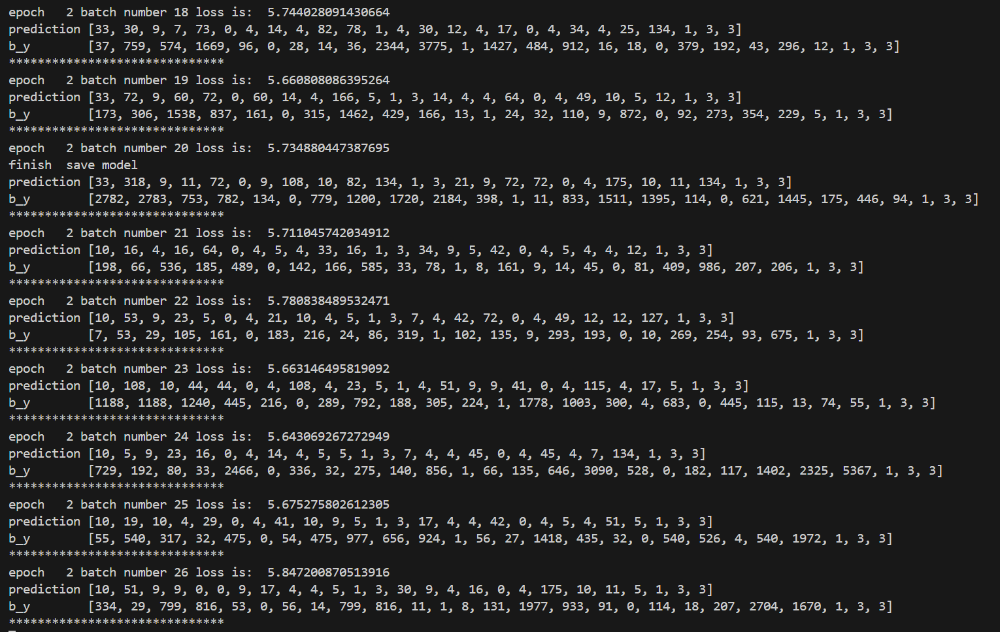

# 诗歌生成实验报告

## 模型简介

RNN：

RNN是一种基础的序列模型，其特点是网络中存在着循环，使得网络能够保持一定的状态或记忆。在处理序列数据时，RNN能够将前一时刻的信息传递到后一时刻，从而捕捉时间序列中的动态特征。RNN的问题在于在面对长序列时容易遇到梯度消失或梯度爆炸的问题，这限制了其在长序列上的性能。

LSTM：

LSTM是为了解决RNN在长序列学习中的梯度问题而提出的一种改进型RNN。LSTM通过引入“门”的概念来控制信息的流动，包括输入门、遗忘门和输出门。这些门能够决定什么信息应该被保留、什么信息应该被遗忘以及什么信息应该被输出到下一个时间步。因此，LSTM能够有效地学习长期依赖关系，并且在很多序列数据处理任务中取得了良好的效果。

GRU：

GRU是另一种RNN的变体，它简化了LSTM的结构，将输入门和遗忘门合并为一个更新门，并且省去了LSTM中的细胞状态。GRU通过更新门来控制信息的流动，同时使用重置门来决定哪些信息应该被忽略，哪些信息应该被传递到输出。GRU的这种简化结构使得它在某些任务中比LSTM更加高效，尤其是在处理较短的序列或者需要更快计算速度的场景下。

## 诗歌生成过程

原来给出的gen_sentence：
1. 随机一个state，并将起始符号bos转成id，作为初始的state和cur_token
2. 调用model的get_next_token函数，获得下一个字符的token，并更新state
3. 字符token转id，收集在collect中
4. 直到循环结束，将collect中所有id转word，并返回

问题在于：
1. 即使token为结束符号eos，诗句生成也不终止
2. 起始字随机

于是增加：
1. cur_token == word2id['eos']的退出循环条件
2. 增加参数start，成初始cur_token，并转为id放入collect

在实验过程中，发现由随机state和固定token开始的诗句容易生成乱码，应该是随机state产生的问题。于是每次开始生成之前，以bos为初始符号和随机state进行一句生成，再取state和固定token进行生成。此时单句不会生成乱码。

同时，发现单句生成上下文之间无联系，出现整首诗句与句之间字数不统一的情况，格式近古体诗。于是将单句生成改为整首生成，每句承接上一句的state。此时整首诗格式统一，类格律诗。

tensorflow单句生成

```python
def gen_sentence(start):
    state = [tf.random.normal(shape=(1, 128), stddev=0.5), tf.random.normal(shape=(1, 128), stddev=0.5)]
    cur_token = tf.constant([word2id['bos']], dtype=tf.int32)
    for _ in range(50):
        cur_token, state = model.get_next_token(cur_token, state)
        if cur_token == word2id['eos']:
            break
    cur_token = tf.constant([word2id[start]], dtype=tf.int32)
    collect = []
    collect.append(cur_token.numpy()[0])
    for _ in range(50):
        cur_token, state = model.get_next_token(cur_token, state)
        if cur_token == word2id['eos']:
            break
        collect.append(cur_token.numpy()[0])
    return [id2word[t] for t in collect]

start_list = ['日','红','山','夜','湖','海','月']
for i, start in enumerate(start_list):
    print(''.join(gen_sentence(start)))
```

tensorflow整首生成

```python
def gen_poem(start_list):
    state = [tf.random.normal(shape=(1, 128), stddev=0.5), tf.random.normal(shape=(1, 128), stddev=0.5)]
    poem = []

    cur_token = tf.constant([word2id['bos']], dtype=tf.int32)
    for _ in range(50):
        cur_token, state = model.get_next_token(cur_token, state)
        if cur_token == word2id['eos']:
            break

    for i, start in enumerate(start_list):
        collect = []
        cur_token = tf.constant([word2id[start]], dtype=tf.int32)
        collect.append(cur_token.numpy()[0])
        for _ in range(50):
            cur_token, state = model.get_next_token(cur_token, state)
            if cur_token == word2id['eos']:
                break
            collect.append(cur_token.numpy()[0])
        poem.append([id2word[t] for t in collect])
    return poem

start_list = ['日','红','山','夜','湖','海','月']
poem = gen_poem(start_list)
for i, sentence in enumerate(poem):
    print(''.join(sentence))
```

## 实验结果

tensorflow生成结果：



更多结果见ipynb

Pytorch训练过程：



由于pytorch现在还没跑完……
所以没有pytorch的生成结果